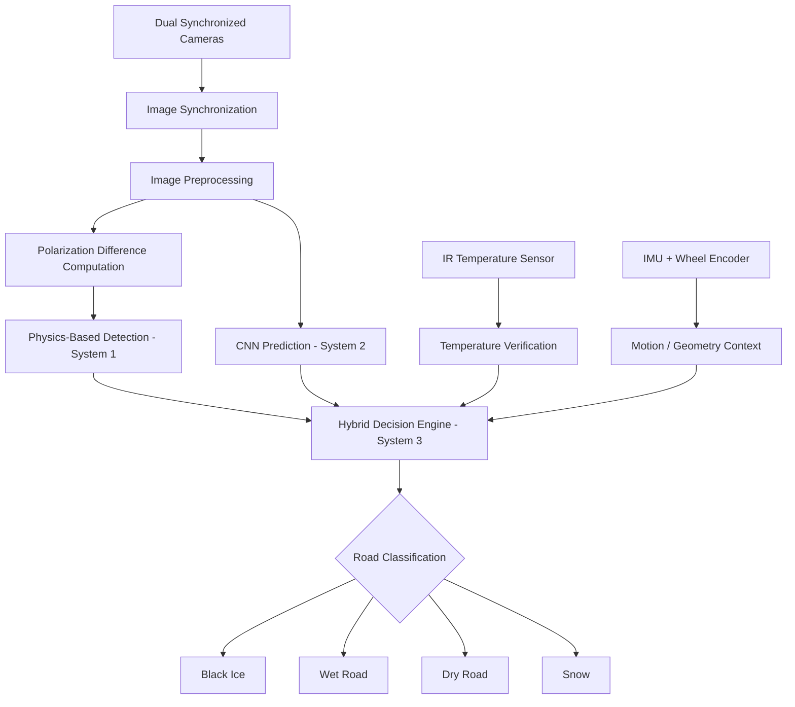

# Black-Ice-Detection-AI

**A hybrid physics + deep learning rover system for detecting hazardous road surface conditions — Black Ice, Wet Road, Dry Road, and Snow.**

[]()
[]()
[]()
[]()

---

## Table of Contents

- [Overview](#overview)
- [Motivation](#motivation)
- [System Architecture](#system-architecture)
- [Hardware](#hardware)
- [Software Pipeline](#software-pipeline)
- [Three Core Systems](#three-core-systems)
- [Repository Structure](#repository-structure)
- [Development Phases](#development-phases)
- [Learning Roadmap](#learning-roadmap)
- [Getting Started](#getting-started)
- [Project Journal](#project-journal)
- [Contributing](#contributing)
- [References](#references)
- [License](#license)

---

## Overview

**Black-Ice-Detection-AI** is a Design Practicum project that builds an AI-powered rover capable of classifying road surface conditions in real time using a combination of **polarization-based physics detection**, a **CNN-based image classifier**, and a **sensor fusion / hybrid decision engine**.

The rover distinguishes between four road states:

| Class | Description |
|---|---|
| 🧊 **Black Ice** | Thin, transparent ice layer — highest hazard, visually deceptive |
| 💧 **Wet Road** | Water film on road surface |
| ☀️ **Dry Road** | Normal, safe driving surface |
| ❄️ **Snow** | Snow-covered surface |

This is **not** a pure deep learning project — it is a **hybrid AI system**, inspired by black ice detection patents that exploit the polarization behavior of light reflecting off ice versus water versus dry asphalt, combined with a learned CNN model and IR temperature verification for redundancy and robustness.

---

## Motivation

Black ice is one of the most dangerous road hazards because it is **visually similar to a wet or dry road**, yet causes a dramatic loss of tire friction. Human drivers and standard RGB-camera-based systems struggle to distinguish it reliably. This project explores whether combining:

1. A **physics-based optical model** (polarization contrast — light reflected off ice partially polarizes differently than off water or dry asphalt), and
2. A **learned visual model** (CNN trained on labeled road surface imagery),

fused with **temperature and inertial context**, can produce a more reliable and interpretable hazard classification than either approach alone.

---

## System Architecture



---

## Hardware

| Component | Purpose |
|---|---|
| Two synchronized cameras | Stereo / dual-angle image capture |
| Orthogonal polarizing filters (0°, 90°) | Enable polarization difference imaging |
| Non-contact IR temperature sensor | Surface temperature verification (ice requires ≤ 0°C conditions) |
| IMU (accelerometer + gyroscope) | Motion context, vibration/slip signal, camera stabilization data |
| Wheel encoder | Speed and distance estimation |
| Raspberry Pi / Jetson Nano | Onboard compute for inference and control |

---

## Software Pipeline

```
Dual Cameras
   ↓
Capture Images
   ↓
Image Synchronization
   ↓
Image Preprocessing
   ↓
Polarization Difference
   ↓
Physics Detection ──────────┐
   ↓                        │
Temperature Verification    │
                             ├──▶ Sensor Fusion ──▶ Hybrid Decision Engine ──▶ Road Classification
CNN Prediction ─────────────┘                                                   │
                                                                    ┌────────────┼────────────┬────────┐
                                                                 Black Ice   Wet Road      Dry Road   Snow
```

---

## Three Core Systems

### System 1 — Physics-Based Detection
No deep learning. Purely optical/physical reasoning, inspired by black ice detection patent literature.

- Polarization difference & contrast mapping
- Classical image processing (thresholding, morphological ops)
- Temperature cross-verification
- Camera geometry & distance estimation
- IMU-assisted stabilization

📂 `physics_model/`

### System 2 — CNN Model
Supervised deep learning image classifier trained on a labeled road-surface dataset.

- Data collection, cleaning, augmentation
- CNN architecture design & training
- Validation & test evaluation
- Model export for edge deployment

📂 `cnn_model/`

### System 3 — Hybrid AI
Fuses Systems 1 and 2 with sensor context into a single, more reliable decision.

- Confidence scoring per model
- Sensor fusion (physics + CNN + temperature + IMU)
- Rule-based / learned decision logic
- Final road classification output

📂 `hybrid_model/`, `sensor_fusion/`

---

## Repository Structure

```
Black-Ice-Detection-AI/
├── README.md
├── ROADMAP.md
├── PROJECT_JOURNAL.md
├── CONTRIBUTING.md
├── LICENSE
├── requirements.txt
├── .gitignore
│
├── docs/
│   ├── learning/
│   │   ├── README.md
│   │   ├── 01_git_github.md
│   │   ├── 02_python.md
│   │   ├── 03_numpy.md
│   │   ├── 04_matplotlib.md
│   │   ├── 05_pandas.md
│   │   ├── 06_opencv.md
│   │   ├── 07_image_processing.md
│   │   ├── 08_machine_learning.md
│   │   ├── 09_deep_learning.md
│   │   ├── 10_neural_networks.md
│   │   ├── 11_cnn.md
│   │   ├── 12_transfer_learning.md
│   │   ├── 13_polarization_imaging.md
│   │   ├── 14_sensor_fusion.md
│   │   ├── 15_imu.md
│   │   ├── 16_temperature_sensor.md
│   │   ├── 17_camera_geometry.md
│   │   ├── 18_model_training.md
│   │   ├── 19_model_evaluation.md
│   │   ├── 20_deployment.md
│   │   ├── 21_raspberry_pi.md
│   │   ├── 22_jetson_nano.md
│   │   ├── 23_optimization.md
│   │   ├── 24_computer_vision_pipeline.md
│   │   ├── 25_hybrid_ai.md
│   │   └── 26_future_work.md
│   │
│   ├── research/
│   │   ├── papers.md
│   │   ├── dataset_links.md
│   │   ├── ideas.md
│   │   ├── references.md
│   │   ├── patents.md
│   │   └── comparison.md
│   │
│   ├── patent_notes/
│   │   ├── patent_summary.md
│   │   ├── algorithm.md
│   │   ├── formulas.md
│   │   ├── implementation_plan.md
│   │   └── limitations.md
│   │
│   └── meeting_notes/
│       ├── meeting_01.md
│       ├── meeting_template.md
│       └── decisions.md
│
├── notebooks/
│   ├── 01_Python.ipynb
│   ├── 02_NumPy.ipynb
│   ├── 03_OpenCV.ipynb
│   ├── 04_ImageProcessing.ipynb
│   ├── 05_PhysicsModel.ipynb
│   ├── 06_CNN.ipynb
│   └── 07_HybridModel.ipynb
│
├── dataset/
│   ├── raw/
│   ├── processed/
│   ├── train/
│   ├── validation/
│   ├── test/
│   └── annotations/
│
├── physics_model/
├── cnn_model/
├── hybrid_model/
├── sensor_fusion/
├── deployment/
│
├── configs/
├── scripts/
├── experiments/
├── tests/
├── results/
├── models/
├── weights/
├── utils/
├── assets/
└── logs/
```

> **Note:** `docs/` now nests `learning/`, `research/`, `patent_notes/`, and `meeting_notes/` under one documentation root. This is the canonical structure — all future files and internal links will follow it exactly.

---

## Development Phases

| Phase | Focus |
|---|---|
| 1 | Repository Setup |
| 2 | Learning |
| 3 | Computer Vision |
| 4 | Physics-Based Detection |
| 5 | CNN Development |
| 6 | Hybrid AI |
| 7 | Sensor Fusion |
| 8 | Evaluation |
| 9 | Deployment |
| 10 | Optimization |

Detailed milestones and timelines are tracked in [`ROADMAP.md`](./ROADMAP.md).

---

## Learning Roadmap

This repository doubles as a structured learning notebook (`docs/learning/`), with 26 numbered modules. Every concept is documented **before** it is implemented, covering Git/GitHub, Python, NumPy, Pandas, Matplotlib, OpenCV, image processing, classical ML, deep learning, CNNs, transfer learning, polarization imaging, sensor fusion, IMU theory, temperature sensing, camera geometry, model training/evaluation, deployment, Raspberry Pi/Jetson Nano, optimization, the full computer vision pipeline, hybrid AI design, and future work.

See [`docs/learning/`](./docs/learning) for the full topic index.

---

## Getting Started

> This section will be filled in once `requirements.txt` and the initial environment setup are established (Phase 1–2).

```bash
git clone https://github.com/<your-username>/Black-Ice-Detection-AI.git
cd Black-Ice-Detection-AI
pip install -r requirements.txt
```

---

## Project Journal

Ongoing progress, decisions, and reflections are logged in [`PROJECT_JOURNAL.md`](./PROJECT_JOURNAL.md).

---

## Contributing

See [`CONTRIBUTING.md`](./CONTRIBUTING.md) for guidelines on contributing to this project.

---

## References

Curated research papers, datasets, and patent references are maintained in [`docs/research/`](./docs/research) and [`docs/patent_notes/`](./docs/patent_notes).

---

## License

This project is licensed under the terms described in [`LICENSE`](./LICENSE).

---

### Project Status

🟡 **Phase 1 — Repository Setup** (in progress)


