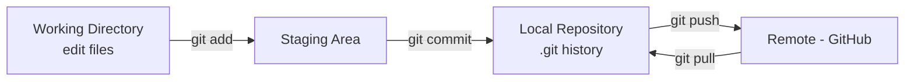

# 🌿 01 — Git & GitHub

> Project: **Black-Ice-Detection-AI**

Git and GitHub are the foundation everything else in this repository sits on. Every learning module, every experiment, every trained model checkpoint eventually gets committed and pushed — so this is deliberately Module 01, before a single line of Python is written.

---

## Learning Objectives

After completing this module, you should be able to:

- Explain what Git is and how it differs from GitHub
- Initialize a repository and make meaningful commits
- Work with branches, merges, and pull requests
- Resolve basic merge conflicts
- Follow a commit and branching convention suited to a research project like this one
- Track large files (datasets, model weights) sensibly instead of bloating the repo

---

## Introduction

### What is Git?

Git is a **distributed version control system** — it tracks changes to files over time, lets you revert to any previous state, and lets multiple people (or multiple versions of yourself, on different machines) work on the same codebase without overwriting each other's work.

### What is GitHub?

GitHub is a **cloud hosting platform for Git repositories**. Git is the tool; GitHub is where this project's repository (`Black-Ice-Detection-AI`) actually lives online, with added features: issue tracking, pull requests, project boards, and collaboration tools. Git works entirely offline; GitHub is the remote you sync with.

### Why Learn This First

Every phase of this project — from Phase 1 (Repository Setup) through Phase 10 (Optimization) — produces artifacts (docs, code, notebooks, experiment logs, model weights) that need to be version-controlled. Without Git fluency, you either lose work, overwrite work, or end up with a folder called `final_v2_ACTUALLY_final.py`. This module exists to prevent that.

---

## Why It Matters (Project Context)

| Project Activity | Git/GitHub's Role |
|---|---|
| Daily development | Commit history = a timestamped record of every change, tied to `PROJECT_JOURNAL.md` entries |
| Experimenting with model architectures | Branches let you try a CNN variant without risking the working version |
| Phase transitions (per `ROADMAP.md`) | Tags/releases can mark "Phase 4 complete" states |
| Collaboration (if a teammate/advisor contributes) | Pull requests + code review before merging into `main` |
| Large files (datasets, `.npy` caches, `weights/*.pt`) | `.gitignore` + Git LFS keep the repo lightweight |

---

## Installing Git

```bash
# Debian/Ubuntu
sudo apt-get install git

# macOS (via Homebrew)
brew install git

# Verify installation
git --version
```

---

## Initial Configuration

```bash
git config --global user.name "Your Name"
git config --global user.email "you@example.com"

# Recommended: set the default branch name to 'main'
git config --global init.defaultBranch main
```

---

## Core Concepts & Terminology

| Term | Meaning |
|---|---|
| **Repository (repo)** | A folder tracked by Git — `Black-Ice-Detection-AI` itself |
| **Commit** | A saved snapshot of changes, with a message describing what changed and why |
| **Branch** | An independent line of development (e.g. `feature/physics-model`) |
| **Remote** | A hosted version of the repo (e.g. `origin` on GitHub) |
| **Clone** | Downloading a full copy of a remote repository |
| **Push / Pull** | Sending local commits to the remote / fetching remote commits locally |
| **Merge** | Combining changes from one branch into another |
| **Pull Request (PR)** | A GitHub feature proposing that changes from one branch be merged into another, with review |
| **`.gitignore`** | A file listing paths Git should never track (already set up in this repo's root) |
| **Staging Area** | Where changes go after `git add`, before they're committed |

---

## The Basic Git Workflow



```bash
git status                  # see what's changed
git add physics_model/detector.py     # stage a specific file
git add .                              # stage everything changed
git commit -m "Add polarization difference function"
git push origin main                   # send commits to GitHub
git pull origin main                   # fetch and merge latest remote changes
```

---

## Cloning This Repository

```bash
git clone https://github.com/<your-username>/Black-Ice-Detection-AI.git
cd Black-Ice-Detection-AI
```

---

## Branching

Branches isolate work-in-progress from the stable `main` branch — essential once you're experimenting with, say, a new CNN architecture that might not work out.

```bash
git branch                          # list branches
git branch feature/cnn-baseline     # create a new branch
git checkout feature/cnn-baseline   # switch to it
# shorthand for both:
git checkout -b feature/cnn-baseline

git switch main                     # modern alternative to checkout for switching
```

**Suggested branch naming convention for this project:**

| Prefix | Use Case |
|---|---|
| `feature/...` | New functionality (e.g. `feature/imu-integration`) |
| `experiment/...` | Model/architecture experiments (e.g. `experiment/resnet-transfer`) |
| `fix/...` | Bug fixes |
| `docs/...` | Documentation-only changes (e.g. `docs/learning-module-06`) |

---

## Merging

```bash
git switch main
git merge feature/cnn-baseline
```

If both branches changed the same lines of the same file, Git can't automatically decide which version is correct — this produces a **merge conflict**.

### Resolving a Merge Conflict

```
<<<<<<< HEAD
threshold = 0.5
=======
threshold = 0.65
>>>>>>> feature/cnn-baseline
```

Manually edit the file to keep the correct value (or combine both), remove the `<<<<<<<`, `=======`, `>>>>>>>` markers, then:

```bash
git add <resolved_file>
git commit
```

---

## Working with GitHub (Remotes & Pull Requests)

```bash
git remote add origin https://github.com/<your-username>/Black-Ice-Detection-AI.git
git remote -v            # verify remote is set correctly
```

**Typical PR workflow** (recommended even solo, for a clean history and self-review discipline):

1. Create a branch: `git checkout -b feature/temperature-verification`
2. Commit your work in logical, well-described chunks
3. Push the branch: `git push origin feature/temperature-verification`
4. Open a Pull Request on GitHub comparing your branch → `main`
5. Review the diff yourself (or have a teammate review), then merge

---

## Commit Message Conventions

Good commit messages make `git log` a readable project history — useful when writing `PROJECT_JOURNAL.md` retrospectively.

```
<type>: <short summary>

<optional longer description>
```

| Type | Use Case |
|---|---|
| `feat` | New feature (e.g. `feat: add polarization difference function`) |
| `fix` | Bug fix |
| `docs` | Documentation changes only |
| `refactor` | Code restructuring, no behavior change |
| `test` | Adding or updating tests |
| `chore` | Tooling, dependencies, config |

Example:
```
feat: implement dual-camera synchronized capture

Uses cap.grab() + cap.retrieve() on both cameras to minimize
timestamp drift between the 0deg and 90deg polarized frames.
```

---

## Undoing Things

```bash
git restore <file>                 # discard uncommitted changes to a file
git reset --soft HEAD~1            # undo last commit, keep changes staged
git reset --hard HEAD~1            # undo last commit, DISCARD changes (careful!)
git revert <commit-hash>           # create a new commit that undoes a previous one (safe for shared history)
```

> ⚠️ `git reset --hard` permanently discards changes. On shared/pushed branches, prefer `git revert` — it doesn't rewrite history that others (or your future self) may have already pulled.

---

## Handling Large Files (Datasets & Model Weights)

Git is not designed for large binary files — datasets and model weights will bloat the repository if committed directly. This repo's `.gitignore` already excludes `dataset/raw/*`, `dataset/processed/*`, and `weights/*` by default (with `.gitkeep` preserving the empty folder structure).

**Options for actually sharing large files:**

| Option | When to Use |
|---|---|
| **Git LFS** (Large File Storage) | Versioned tracking of specific large files (e.g. a few key model checkpoints) |
| **External storage + `dataset_links.md`** | Full datasets — link to Google Drive/cloud storage instead of committing |
| **Release assets** | Attaching a final trained model to a GitHub Release, not the repo itself |

```bash
# Example: Git LFS setup, if adopted later
git lfs install
git lfs track "weights/*.pt"
git add .gitattributes
```

---

## Real Project Application

A realistic day-to-day sequence for this project:

```bash
git switch main
git pull origin main

git checkout -b experiment/otsu-vs-adaptive-threshold

# ... edit physics_model/threshold.py, run tests ...

git add physics_model/threshold.py experiments/threshold_comparison.md
git commit -m "experiment: compare Otsu vs adaptive thresholding on test set"

git push origin experiment/otsu-vs-adaptive-threshold
# Open PR on GitHub, review, merge into main
```

---

## Best Practices

- Commit early, commit often — small, focused commits are easier to review and revert than one giant "final changes" commit
- Write commit messages that explain *why*, not just *what* (the diff already shows what)
- Never commit secrets, API keys, or large raw datasets — check `.gitignore` before your first commit in a new folder
- Use branches for anything experimental (new model architecture, risky refactor)
- Pull before you start new work, to avoid unnecessary conflicts

---

## Common Mistakes

- Committing directly to `main` for large or risky changes instead of using a branch + PR
- Vague commit messages like `"fixed stuff"` or `"update"` — useless when trying to trace back a bug months later
- Accidentally committing `dataset/raw/` or `weights/` before `.gitignore` is set up, bloating repo history permanently (removing large files from history after the fact is painful — `git filter-repo` or BFG Repo-Cleaner territory)
- Using `git reset --hard` on a branch that's already been pushed and pulled by someone else
- Forgetting to `git pull` before starting work, leading to avoidable merge conflicts

---

## Performance Tips

- Keep the repository lightweight: `.gitignore` datasets/weights, use Git LFS or external links for anything large
- Use `git status` and `git diff` frequently before committing, to know exactly what you're about to commit
- Squash noisy work-in-progress commits into a clean commit before merging, if the branch's history is messy
  
---

## Summary

Git provides version control for every artifact in this repository; GitHub hosts it and adds collaboration tooling (PRs, issues, releases). The core daily loop — `add → commit → push/pull` — plus disciplined branching and `.gitignore` hygiene for large files, is what keeps a research project like Black-Ice-Detection-AI navigable as it grows across 10 development phases.

## Revision Notes

- Git = version control tool (local); GitHub = hosting platform (remote)
- Workflow: `git add` → `git commit` → `git push`/`git pull`
- Branch before experimenting; merge/PR when ready
- Never commit datasets or weights directly — use `.gitignore` + Git LFS/external links
- Prefer `git revert` over `git reset --hard` on shared branches

## References

- [Pro Git Book (free, official)](https://git-scm.com/book/en/v2)
- [GitHub Docs — Getting Started](https://docs.github.com/en/get-started)
- [Git LFS Documentation](https://git-lfs.com/)

---

## Next Topic

➡️ [`02_python.md`](./02_python.md) — **Python**

With version control in place, the next module covers the Python fundamentals every subsequent module and the entire codebase are built on.
