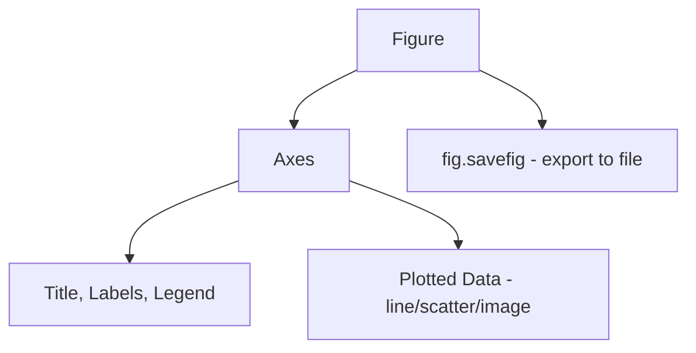

# 📊 03 — Matplotlib for Visualization

> Project: **Black-Ice-Detection-AI**

---

## Learning Objectives

After completing this module, you should be able to:

- Create and customize basic plots (line, scatter, bar, histogram)
- Display images and heatmaps directly from NumPy arrays
- Build multi-panel figures for comparing results side by side
- Plot CNN training curves and evaluation metrics correctly
- Save publication-quality figures for reports and the practicum writeup
- Apply all of the above to concrete Black-Ice-Detection-AI outputs

---

## Introduction

### What is Matplotlib?

Matplotlib is a plotting library that renders NumPy arrays (and other data) as figures — line plots, scatter plots, images, heatmaps, and more. It's the most widely used visualization library in the Python scientific stack and integrates directly with NumPy and Pandas.

### Why Matplotlib Is Important Here

You cannot debug or communicate what a CNN is learning, or what the physics-based detector is actually detecting, purely by reading numbers off a terminal. Visualization is how you catch a broken preprocessing step (an image that looks wrong before you even train on it), how you diagnose overfitting (a widening gap between train/validation loss curves), and how you present results in your practicum documentation.

---

## Why It Matters (Project Context)

| Pipeline Stage | Matplotlib's Role |
|---|---|
| Sensor data review | Plotting raw IMU/temperature readings over time |
| Polarization analysis | Visualizing the polarization difference map as a heatmap |
| Physics detection (System 1) | Side-by-side comparison of original frame, mask, and detected regions |
| CNN training (System 2) | Loss and accuracy curves across epochs |
| Model evaluation (Phase 8) | Confusion matrices, ROC curves, per-class accuracy bar charts |
| Practicum documentation | Exporting all of the above as figures for reports |

---

## Installing Matplotlib

```bash
pip install matplotlib
```

```python
import matplotlib.pyplot as plt
print(plt.matplotlib.__version__)
```

---

## Basic Plot Anatomy



| Term | Meaning |
|---|---|
| **Figure** | The overall window/canvas |
| **Axes** | An individual plot area within a figure (a figure can have multiple) |
| **Artist** | Anything drawn on the axes (lines, text, images) |

---

## Line Plots

```python
import matplotlib.pyplot as plt
import numpy as np

epochs = np.arange(1, 21)
train_loss = np.linspace(1.2, 0.15, 20) + np.random.normal(0, 0.02, 20)
val_loss = np.linspace(1.3, 0.35, 20) + np.random.normal(0, 0.03, 20)

plt.figure(figsize=(8, 5))
plt.plot(epochs, train_loss, label="Train Loss", color="#1f77b4")
plt.plot(epochs, val_loss, label="Validation Loss", color="#d62728")
plt.xlabel("Epoch")
plt.ylabel("Loss")
plt.title("CNN Training Curve — Black Ice Classifier")
plt.legend()
plt.grid(alpha=0.3)
plt.savefig("results/training_curve.png", dpi=150, bbox_inches="tight")
plt.show()
```

**Project use case:** this exact pattern — train vs. validation curves — is how you'll spot overfitting in System 2's CNN. A validation loss that stops decreasing (or increases) while training loss keeps falling is the classic overfitting signature.

---

## Scatter Plots

```python
confidence_physics = np.random.uniform(0, 1, 100)
confidence_cnn = np.random.uniform(0, 1, 100)
is_correct = np.random.choice([0, 1], 100, p=[0.2, 0.8])

plt.scatter(confidence_physics, confidence_cnn, c=is_correct, cmap="RdYlGn", alpha=0.7)
plt.xlabel("Physics Model Confidence")
plt.ylabel("CNN Confidence")
plt.title("Agreement Between System 1 and System 2")
plt.colorbar(label="Correct Prediction")
plt.show()
```

**Project use case:** this is directly useful for designing the **Hybrid Decision Engine** (Phase 6) — visualizing where the two systems agree/disagree, and whether agreement correlates with correctness, informs your fusion logic.

---

## Bar Charts

```python
classes = ["Black Ice", "Wet Road", "Dry Road", "Snow"]
accuracy = [0.81, 0.90, 0.95, 0.88]

plt.bar(classes, accuracy, color=["#3b3b58", "#4a90d9", "#f4a261", "#e0f7fa"])
plt.ylabel("Accuracy")
plt.title("Per-Class Accuracy — Hybrid Model")
plt.ylim(0, 1)
for i, v in enumerate(accuracy):
    plt.text(i, v + 0.02, f"{v:.0%}", ha="center")
plt.show()
```

**Project use case:** per-class accuracy is more informative than a single overall accuracy number — you specifically need to know if Black Ice (the highest-stakes class) is under-performing relative to the others, since a system that's great at Dry Road but weak at Black Ice is dangerous, not just imperfect.

---

## Histograms

```python
temps = np.random.normal(-2, 3, 500)   # simulated IR sensor readings, degrees C

plt.hist(temps, bins=30, color="#4a90d9", edgecolor="black", alpha=0.8)
plt.axvline(0, color="red", linestyle="--", label="Freezing Point (0°C)")
plt.xlabel("Surface Temperature (°C)")
plt.ylabel("Frequency")
plt.title("Distribution of IR Temperature Readings")
plt.legend()
plt.show()
```

**Project use case:** understanding the distribution of temperature readings across your dataset helps validate the temperature verification threshold used in System 1 — ice formation requires surface temperatures at or below freezing.

---

## Displaying Images (`imshow`)

```python
import cv2

img = cv2.imread("dataset/raw/sample_road.jpg")
img_rgb = cv2.cvtColor(img, cv2.COLOR_BGR2RGB)   # convert BGR -> RGB before plt.imshow!

plt.imshow(img_rgb)
plt.title("Sample Road Frame")
plt.axis("off")
plt.show()
```

> ⚠️ **Recurring gotcha:** OpenCV loads images as BGR ([Module 06](./06_opencv.md)); Matplotlib's `imshow()` expects RGB. Skipping the conversion produces a color-swapped, wrong-looking image — this is one of the most common "why does my image look weird" bugs in this exact pipeline.

---

## Heatmaps (Polarization Contrast Maps)

```python
polarization_diff = np.random.uniform(0, 255, (100, 100))

plt.imshow(polarization_diff, cmap="inferno")
plt.colorbar(label="Contrast Intensity")
plt.title("Polarization Difference Map")
plt.axis("off")
plt.show()
```

**Project use case:** this is the primary way to *see* System 1's core signal — the raw numeric polarization difference array, rendered as a heatmap, is how you visually verify the physics detector is picking up a real optical signature and not just noise.

---

## Multi-Panel Figures (`subplots`)

```python
fig, axes = plt.subplots(1, 3, figsize=(15, 5))

axes[0].imshow(img_rgb)
axes[0].set_title("Original Frame")
axes[0].axis("off")

axes[1].imshow(polarization_diff, cmap="inferno")
axes[1].set_title("Polarization Difference")
axes[1].axis("off")

axes[2].imshow(mask, cmap="gray")
axes[2].set_title("Thresholded Mask")
axes[2].axis("off")

plt.tight_layout()
plt.savefig("results/system1_pipeline_stages.png", dpi=150)
plt.show()
```

**Project use case:** side-by-side pipeline-stage figures like this are exactly what belongs in your practicum report to explain System 1's process visually, and are invaluable for debugging — you can immediately see *which* stage of the pipeline broke.

---

## Confusion Matrices

```python
from sklearn.metrics import confusion_matrix
import numpy as np

y_true = np.random.choice(classes, 200)
y_pred = np.random.choice(classes, 200)
cm = confusion_matrix(y_true, y_pred, labels=classes)

fig, ax = plt.subplots(figsize=(6, 5))
im = ax.imshow(cm, cmap="Blues")
ax.set_xticks(range(len(classes)))
ax.set_yticks(range(len(classes)))
ax.set_xticklabels(classes, rotation=45, ha="right")
ax.set_yticklabels(classes)
ax.set_xlabel("Predicted")
ax.set_ylabel("Actual")
ax.set_title("Confusion Matrix — Road Surface Classification")

for i in range(len(classes)):
    for j in range(len(classes)):
        ax.text(j, i, cm[i, j], ha="center", va="center",
                 color="white" if cm[i, j] > cm.max() / 2 else "black")

plt.colorbar(im)
plt.tight_layout()
plt.savefig("results/confusion_matrix.png", dpi=150)
plt.show()
```

**Project use case:** this is the single most important evaluation figure for Phase 8. It tells you not just overall accuracy but *which classes get confused with which* — e.g., if Black Ice is frequently misclassified as Wet Road, that's a critical, safety-relevant failure mode worth its own investigation.

---

## Saving Figures

```python
plt.savefig("results/figure_name.png", dpi=150, bbox_inches="tight")
```

| Parameter | Purpose |
|---|---|
| `dpi=150` (or higher) | Resolution — use 300 for print-quality practicum report figures |
| `bbox_inches="tight"` | Trims excess whitespace around the figure |
| File extension | `.png` for raster (most common), `.svg`/`.pdf` for vector (scales cleanly in reports) |

> Always call `savefig()` *before* `plt.show()` — some backends clear the figure after displaying it, resulting in a blank saved file.

---

## Real Project Application

A reusable evaluation-plotting function you'll likely want in `utils/`:

```python
import matplotlib.pyplot as plt

def plot_training_curves(history: dict, save_path: str = None):
    """Plot train/validation loss and accuracy curves from a Keras/PyTorch-style history dict."""
    fig, axes = plt.subplots(1, 2, figsize=(12, 5))

    axes[0].plot(history["train_loss"], label="Train")
    axes[0].plot(history["val_loss"], label="Validation")
    axes[0].set_title("Loss")
    axes[0].set_xlabel("Epoch")
    axes[0].legend()
    axes[0].grid(alpha=0.3)

    axes[1].plot(history["train_acc"], label="Train")
    axes[1].plot(history["val_acc"], label="Validation")
    axes[1].set_title("Accuracy")
    axes[1].set_xlabel("Epoch")
    axes[1].legend()
    axes[1].grid(alpha=0.3)

    plt.tight_layout()
    if save_path:
        plt.savefig(save_path, dpi=150, bbox_inches="tight")
    plt.show()
```

---

## Best Practices

- Always label axes and add a title — an unlabeled plot is nearly useless three weeks later
- Convert BGR → RGB before `imshow()` when the source image came from OpenCV
- Use `plt.tight_layout()` on multi-panel figures to avoid overlapping labels
- Save figures at `dpi=150+` for anything going into a report or presentation
- Pick colormaps deliberately: `inferno`/`viridis` for continuous data (heatmaps), qualitative palettes for discrete categories — avoid rainbow-like `jet` for scientific figures, as it visually distorts perceived magnitude differences

---

## Common Mistakes

- Forgetting the BGR → RGB conversion before `imshow()`, producing color-swapped images
- Calling `plt.show()` before `plt.savefig()`, resulting in a blank saved file on some backends
- Plotting only training loss without validation loss, missing overfitting entirely
- Using default, unlabeled axes in a figure meant for a report — always add units (e.g. "°C", "Epoch")
- Overcrowding a single figure with too many lines/panels — split into multiple figures if it gets hard to read

---

## Performance Tips

- Close figures explicitly (`plt.close(fig)`) in loops (e.g. generating one figure per experiment) to avoid memory buildup
- Use vectorized NumPy arrays as plot input rather than Python lists built in a loop — plotting 10,000 points from a NumPy array is far faster than appending to a list first
- For real-time/live plotting (e.g. a live sensor dashboard), investigate `matplotlib.animation` rather than repeatedly closing and reopening figures

---

## Summary

Matplotlib turns NumPy arrays and evaluation metrics into figures you can actually reason about — training curves reveal overfitting, heatmaps reveal whether the physics detector's polarization signal is real, and confusion matrices reveal exactly which road classes get confused with which. Every one of these figure types will reappear repeatedly from Phase 4 (Physics-Based Detection) onward through Phase 8 (Evaluation) and into your final practicum report.

## Revision Notes

- `Figure` = whole canvas; `Axes` = an individual plot within it
- Convert BGR → RGB before `imshow()` on OpenCV images
- Always plot train *and* validation curves together to catch overfitting
- Confusion matrix > single accuracy number for multi-class, safety-relevant classification
- `savefig()` before `show()`, with `dpi=150+` and `bbox_inches="tight"`
  
---

## Next Topic

➡️ [`04_pandas.md`](./04_pandas.md) — **Pandas**

The next module covers structured data handling — managing the dataset's labels/annotations and logging experiment results in tabular form.

