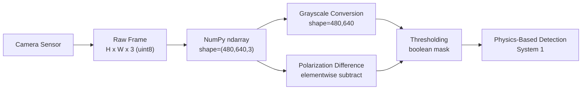

# 🔢 03 — NumPy for AI Development

> Project: **Black-Ice-Detection-AI**

NumPy (**Num**erical **Py**thon) is the fundamental library for numerical computing in Python. It provides efficient multidimensional arrays and vectorized mathematical operations that form the backbone of Computer Vision, Machine Learning, and Deep Learning.

In this project, NumPy is used **everywhere numbers touch pixels or sensors** — image representation, polarization contrast math, temperature/IMU data processing, and preparing tensors for the CNN.

---

## Learning Objectives

After completing this module, you should be able to:

- Understand what a NumPy array is and why it exists
- Create, index, slice, and reshape arrays confidently
- Perform vectorized mathematical and statistical operations
- Understand broadcasting and use it correctly
- Represent and manipulate images as NumPy arrays
- Apply every one of the above directly to Black Ice Detection AI's pipeline

---

## Introduction

### What is NumPy?

NumPy is a Python library that provides the `ndarray` — an N-dimensional array object — along with a large collection of fast, vectorized mathematical functions that operate on those arrays. It is written in C under the hood, which is why it is orders of magnitude faster than equivalent pure-Python loops.

### Why NumPy is Important

Every major Python library in this project's stack is either built on NumPy or interoperates with it:

- **OpenCV** returns images as NumPy arrays
- **PyTorch / TensorFlow** tensors convert to/from NumPy arrays
- **Pandas** DataFrames are backed by NumPy arrays column-wise
- **Matplotlib** plots NumPy arrays directly

If you don't understand NumPy, none of the layers above it will make sense — you'll be copy-pasting code instead of reasoning about it.

### Why Learn NumPy Before OpenCV

An image *is* a NumPy array — specifically, a 2D or 3D array of pixel intensities. Before you can meaningfully process, threshold, or transform an image in OpenCV, you need to understand what shape, dtype, and indexing mean for an array. Skipping this step is the single most common reason beginners get confused by "weird" OpenCV behavior (e.g., BGR vs RGB channel order, dtype overflow on `uint8`).

---

## Why It Matters (Project Context)

Nearly every stage of the Black-Ice-Detection-AI pipeline touches NumPy directly:

| Pipeline Stage | NumPy's Role |
|---|---|
| Image capture | Raw frame stored as a NumPy array (`H × W × 3`) |
| Polarization difference | Elementwise subtraction of two polarized images |
| Thresholding / morphology | Boolean masking over pixel arrays |
| Temperature/IMU logging | 1D/2D arrays of sensor readings over time |
| CNN input prep | Normalization, reshaping into `(N, C, H, W)` tensors |
| Sensor fusion | Combining physics score + CNN confidence + temperature into a single feature vector |

---

## Installing NumPy

```bash
pip install numpy
```

Verify installation and check the version:

```bash
python -c "import numpy; print(numpy.__version__)"
```

---

## Importing NumPy

```python
import numpy as np
```

`np` is the near-universal convention — every example in this repo, and virtually every NumPy example you'll find anywhere, uses it. Don't deviate from this; consistency matters for readability across the team.

---

## Why NumPy? (Over Python Lists)

| Aspect | Python List | NumPy Array |
|---|---|---|
| Storage | Boxed Python objects, scattered in memory | Contiguous, fixed-type memory block |
| Speed | Slow (interpreted loop per element) | Fast (vectorized C loops) |
| Memory | High overhead per element | Compact, minimal overhead |
| Math operations | Manual loops required | Built-in vectorized operations |
| Use case | General-purpose Python | Scientific / numerical computing |

**Quick benchmark intuition:** summing one million numbers with a Python `for` loop takes on the order of tens of milliseconds; the equivalent `np.sum()` call takes a fraction of that, because NumPy pushes the loop down into compiled C code operating on a contiguous memory block instead of a scattered array of Python objects.

---

## NumPy Arrays

An **array** (`ndarray`) is a grid of values, all of the same type, indexed by a tuple of non-negative integers (its "shape").

```python
import numpy as np

# 1D array — e.g. a single sensor reading sequence (IMU accel over time)
a1 = np.array([0.1, 0.2, 0.15, 0.3])

# 2D array — e.g. a single-channel (grayscale) image
a2 = np.array([[0, 128, 255],
                [64, 192, 32]])

# 3D array — e.g. an RGB image (Height x Width x Channels)
a3 = np.zeros((480, 640, 3), dtype=np.uint8)
```

| Dimensionality | Real-World Example in This Project |
|---|---|
| 1D | A single IMU axis reading over time, a 1D temperature log |
| 2D | A grayscale polarization-difference map |
| 3D | A captured RGB camera frame (`H × W × 3`) |
| 4D | A batch of images fed to the CNN (`N × H × W × C`) |

---

## Python Lists vs NumPy Arrays

```python
py_list = [1, 2, 3]
np_array = np.array([1, 2, 3])

py_list * 2      # [1, 2, 3, 1, 2, 3]  -> list repetition, NOT math
np_array * 2     # array([2, 4, 6])    -> elementwise multiplication
```

This single example is the most important intuition to internalize: **Python lists repeat, NumPy arrays compute.** Every "why doesn't this work like I expected" bug with lists-instead-of-arrays traces back to this.

**When to use each:**
- Use Python lists for small, heterogeneous, non-numeric collections (e.g., a list of filenames).
- Use NumPy arrays for anything numeric, especially images, sensor data, or model inputs.

---

## Creating Arrays

```python
np.array([1, 2, 3])              # from existing data
np.zeros((3, 3))                 # 3x3 array of zeros — e.g. blank mask
np.ones((480, 640))              # all-ones — e.g. full-confidence mask
np.empty((2, 2))                 # uninitialized — fast but garbage values
np.eye(3)                        # 3x3 identity matrix — used in camera calibration
np.arange(0, 10, 2)              # [0, 2, 4, 6, 8] — evenly spaced by step
np.linspace(0, 1, 5)             # [0, 0.25, 0.5, 0.75, 1.0] — evenly spaced by count
np.random.rand(3, 3)             # random floats in [0, 1)
```

**Project use case:** `np.zeros((H, W), dtype=np.uint8)` is exactly how you'd initialize a blank binary mask before drawing detected ice regions onto it.

---

## Array Attributes

```python
img = np.zeros((480, 640, 3), dtype=np.uint8)

img.shape     # (480, 640, 3) — height, width, channels
img.ndim      # 3 — number of dimensions
img.size      # 921600 — total number of elements
img.dtype     # dtype('uint8') — data type of each element
img.itemsize  # 1 — bytes per element
img.nbytes    # 921600 — total bytes consumed
```

`shape` is the attribute you will check most often in this project — a shape mismatch between the two polarization images, or between the CNN's expected input and your preprocessed frame, is the single most common runtime error you'll debug.

---

## Array Indexing

```python
a = np.array([10, 20, 30, 40, 50])
a[0]          # 10 — first element
a[-1]         # 50 — last element (negative indexing)

img = np.zeros((480, 640, 3), dtype=np.uint8)
img[100, 200]        # pixel at row 100, col 200 -> array([0, 0, 0])
img[100, 200, 0]     # just the Blue channel value at that pixel (OpenCV order)
```

---

## Array Slicing

```python
a = np.array([10, 20, 30, 40, 50])
a[1:4]        # [20, 30, 40]
a[:3]         # [10, 20, 30]
a[::2]        # [10, 30, 50] — every other element

img = np.zeros((480, 640, 3), dtype=np.uint8)
row = img[100, :]           # entire row 100
col = img[:, 200]           # entire column 200
crop = img[50:150, 100:300] # crop a region — top-left(50,100) to (150,300)
```

**Project use case:** cropping the region of the road surface directly in front of the rover, or extracting a fixed-size patch around a detected candidate ice region for closer inspection.

---

## Mathematical Operations

```python
a = np.array([1, 2, 3])
b = np.array([4, 5, 6])

a + b     # [5, 7, 9]
a - b     # [-3, -3, -3]
a * b     # [4, 10, 18]  -- elementwise, NOT matrix multiplication
a / b     # [0.25, 0.4, 0.5]
a ** 2    # [1, 4, 9]
a % 2     # [1, 0, 1]
```

**Project use case:** polarization difference is literally this pattern —

```python
polarization_diff = img_0deg.astype(np.int16) - img_90deg.astype(np.int16)
```

(Note the cast to `int16` before subtracting — see [Common Mistakes](#common-mistakes) below on `uint8` overflow.)

---

## Broadcasting

**Broadcasting** lets NumPy perform operations on arrays of different but compatible shapes without explicitly copying data.

**Broadcasting rules:** two dimensions are compatible when they are equal, or one of them is 1.

```python
img = np.ones((480, 640, 3), dtype=np.uint8)   # RGB image
brightness = np.array([10, 0, 0])              # shape (3,)

brighter = img + brightness   # broadcasts (3,) across every pixel's channel dim
```

**Project use case:** normalizing an entire image by subtracting per-channel mean and dividing by per-channel standard deviation before feeding it to the CNN — a shape `(3,)` mean/std array broadcasts across every pixel in the `(H, W, 3)` image in one operation, no loop required.

---

## Reshaping Arrays

```python
a = np.arange(12)          # shape (12,)
a.reshape(3, 4)            # shape (3, 4)
a.reshape(2, 2, 3)         # shape (2, 2, 3)

img.flatten()               # collapses to 1D, always returns a copy
img.ravel()                  # collapses to 1D, returns a view when possible (faster)
img.resize((240, 320, 3))   # reshapes in-place, can change total size (pads/truncates)
```

**Project use case:** flattening a feature map before a fully-connected layer, or reshaping a single image `(H, W, 3)` into a batch of size 1 `(1, H, W, 3)` before passing it to the CNN.

---

## Array Manipulation

```python
a = np.zeros((480, 640, 3))
a.transpose(2, 0, 1)     # (3, 480, 640) — HWC -> CHW, needed for PyTorch
a.swapaxes(0, 1)         # swap height and width axes

np.concatenate([a, a], axis=0)   # stack along an existing axis
np.append(arr, [1, 2, 3])        # add elements (returns new array)
np.insert(arr, 1, 99)            # insert value at index 1
np.delete(arr, 0)                # remove element at index 0
```

**Project use case:** `transpose(2, 0, 1)` is essential when moving an OpenCV image (`H, W, C`) into a PyTorch tensor, which expects `(C, H, W)`.

---

## Joining Arrays

```python
a = np.array([1, 2, 3])
b = np.array([4, 5, 6])

np.concatenate([a, b])      # [1, 2, 3, 4, 5, 6]
np.stack([a, b])            # [[1, 2, 3], [4, 5, 6]] — new axis
np.hstack([a, b])           # horizontal stack
np.vstack([a, b])           # vertical stack
```

**Project use case:** stacking the two polarization-filtered images along a new axis before computing a combined contrast map, or stacking sensor readings (IMU + temperature) into a single feature vector for the hybrid fusion model.

---

## Splitting Arrays

```python
a = np.arange(9)
np.split(a, 3)        # three equal chunks

img = np.zeros((480, 640, 3))
np.hsplit(img, 2)      # split into left half / right half
np.vsplit(img, 2)      # split into top half / bottom half
```

**Project use case:** splitting a stereo camera frame pair if it's captured as a single side-by-side image before synchronization.

---

## Statistical Functions

```python
a = np.array([1, 2, 3, 4, 5])

a.mean()    # 3.0
np.median(a)  # 3.0
a.std()     # 1.414... — standard deviation
a.var()     # 2.0 — variance
a.min()     # 1
a.max()     # 5
a.sum()     # 15
```

**Project use case:** computing the mean and standard deviation of pixel intensities within a candidate ice region — a low-variance, low-mean region combined with the right polarization signature is characteristic of black ice.

---

## Mathematical Functions

```python
np.sqrt(a)   # elementwise square root
np.exp(a)    # elementwise e^x — used in softmax computations
np.log(a)    # natural log
np.sin(a); np.cos(a); np.tan(a)   # trigonometric — used in camera geometry math
```

**Project use case:** `np.exp` and `np.log` appear directly if you implement a manual softmax or cross-entropy loss; `np.sin`/`np.cos` appear in camera geometry calculations for distance/angle estimation (module 17).

---

## Boolean Masking & Filtering

```python
img = np.random.randint(0, 256, (5, 5))

mask = img > 200          # boolean array, same shape as img
img[mask]                 # 1D array of only the values > 200
img[img < 50] = 0         # set all pixels below 50 to 0 (thresholding!)
```

This **is** thresholding — the core operation behind System 1's physics-based detection, before OpenCV's `cv2.threshold()` even enters the picture. Understanding it in raw NumPy first demystifies what OpenCV is doing internally.

---

## Random Number Generation

```python
np.random.seed(42)          # reproducibility — ALWAYS set this in experiments

np.random.randint(0, 256, (5, 5))   # random integers, e.g. simulated pixel noise
np.random.random((3, 3))            # random floats in [0, 1)
np.random.rand(3, 3)                # same as above, different call signature
np.random.randn(3, 3)               # samples from a standard normal distribution
```

**Project use case:** setting a random seed before every training run and every data augmentation step so experiments in `experiments/` are reproducible — a non-negotiable practice for any research-quality project.

---

## Saving and Loading Arrays

```python
np.save('mask.npy', mask_array)          # binary format, preserves dtype/shape exactly
loaded = np.load('mask.npy')

np.savetxt('readings.csv', imu_data, delimiter=',')   # human-readable text
loaded_txt = np.loadtxt('readings.csv', delimiter=',')
```

**Project use case:** caching preprocessed polarization-difference maps to disk (`.npy`) so you don't recompute them every training run; logging raw IMU/temperature readings to `.csv` for later inspection in `logs/`.

---

## Performance Benefits

**Vectorization** means expressing an operation over an entire array at once instead of looping element-by-element in Python.

```python
# Slow — pure Python loop
result = []
for x in big_list:
    result.append(x * 2)

# Fast — vectorized
result = big_array * 2
```

**Why loops are slow:** each iteration of a Python `for` loop pays interpreter overhead — type checking, object creation — for every single element. NumPy's vectorized operations execute the loop once, in compiled C, over contiguous memory.

**Rule of thumb for this project:** if you find yourself writing a `for` loop over pixels, stop — there is almost always a vectorized NumPy or OpenCV equivalent, and it will be needed for anything running in real time on Raspberry Pi / Jetson Nano hardware.

---

## Image Representation Using NumPy

- A **grayscale image** is a 2D array: shape `(H, W)`, each value typically `0–255` (`uint8`) representing intensity.
- An **RGB image** (or BGR, as OpenCV loads it) is a 3D array: shape `(H, W, 3)`.
- **Pixel values** for 8-bit images range `0` (black/no signal) to `255` (full intensity), stored as `dtype=np.uint8`.

```python
gray_img.shape    # (480, 640)         -> single intensity channel
rgb_img.shape     # (480, 640, 3)      -> three color channels
rgb_img[0, 0]     # e.g. array([12, 34, 200], dtype=uint8) -> one pixel's B,G,R values
```



---

## Application in Black Ice Detection AI

NumPy underlies nearly every stage of the project:

- **Camera image processing** — every captured frame is a NumPy array from the moment OpenCV reads it
- **Polarization image analysis** — elementwise subtraction between 0° and 90° filtered frames
- **Feature extraction** — computing mean/variance/contrast statistics over candidate regions
- **Temperature data processing** — 1D arrays of IR sensor readings, smoothed and thresholded
- **CNN input preparation** — normalization, reshaping, batching before every forward pass
- **Sensor fusion** — concatenating physics score + CNN confidence + temperature + IMU features into one fusion vector
- **Physics-based model** — thresholding, morphological mask math (all NumPy boolean array operations)
- **Hybrid AI model** — the final decision layer operates on NumPy arrays of confidence scores from both systems

---

## Common NumPy Functions Cheat Sheet

| Category | Functions |
|---|---|
| Creation | `array`, `zeros`, `ones`, `empty`, `eye`, `arange`, `linspace`, `random.rand` |
| Inspection | `shape`, `ndim`, `size`, `dtype`, `itemsize`, `nbytes` |
| Indexing/Slicing | `a[i]`, `a[i:j]`, `a[i, j]`, `a[mask]` |
| Math | `+ - * / ** %`, `sqrt`, `exp`, `log`, `sin`, `cos` |
| Stats | `mean`, `median`, `std`, `var`, `min`, `max`, `sum` |
| Shape ops | `reshape`, `flatten`, `ravel`, `transpose`, `swapaxes` |
| Combine/Split | `concatenate`, `stack`, `hstack`, `vstack`, `split`, `hsplit`, `vsplit` |
| I/O | `save`, `load`, `savetxt`, `loadtxt` |
| Random | `random.seed`, `random.randint`, `random.rand`, `random.randn` |

---

## Best Practices

- Prefer vectorized operations over explicit Python loops — always
- Avoid unnecessary loops, especially over image pixels
- Choose the correct `dtype` explicitly (`uint8` for raw images, `float32` for model input) instead of relying on defaults
- Always check `.shape` before and after operations that reshape/combine arrays — print it if unsure
- Write modular functions (`preprocess_image()`, `compute_polarization_diff()`) instead of inline scripts, so `physics_model/` and `cnn_model/` stay reusable and testable

---

## Common Mistakes

- **Shape mismatch** — subtracting or stacking arrays with incompatible shapes; always verify `.shape` first
- **Wrong data type** — subtracting two `uint8` images directly causes **silent integer overflow/underflow** (e.g., `10 - 20` wraps to `246` instead of `-10`); cast to `int16` or `float32` first
- **Confusing copy and view** — slicing (`a[1:3]`) returns a *view* (shares memory with the original); `.flatten()` returns a *copy*; modifying a view unexpectedly changes the original array
- **Broadcasting errors** — assuming two arrays will broadcast when their trailing dimensions don't actually match, causing a `ValueError`
- **Indexing mistakes** — mixing up `img[y, x]` (row, column = height, width) with `(x, y)` image coordinate conventions used elsewhere (e.g., OpenCV drawing functions expect `(x, y)`)

---

## Performance Tips

- Use in-place operations (`a += 1`) instead of creating new arrays where possible, to reduce memory churn on resource-constrained devices (Raspberry Pi / Jetson Nano)
- Prefer `np.ravel()` over `np.flatten()` when you don't need a guaranteed copy — it avoids an unnecessary memory allocation
- Batch operations across full arrays/images rather than processing one pixel or one frame at a time in Python
- Preallocate arrays (`np.zeros(shape)`) when the final size is known, instead of growing arrays incrementally in a loop

---

## Exercises

1. Create a 5×5 NumPy array of random integers between 0 and 255. Compute its mean, min, and max.
2. Simulate two "polarization filtered" grayscale images as random `uint8` arrays of shape `(100, 100)`. Compute their difference correctly (avoiding overflow), then threshold the result at a value of your choice to produce a boolean mask.
3. Given an RGB image array of shape `(480, 640, 3)`, write a function that crops the center 200×200 region.
4. Write a function that normalizes an image array (`uint8`, 0–255) to `float32` in the range `[0, 1]`.
5. Simulate 100 IMU readings as a 1D array and compute a simple moving average using slicing (no external libraries).

## Practice Questions

1. What is the difference between `.flatten()` and `.ravel()`, and when would the difference matter for performance?
2. Why does subtracting two `uint8` NumPy arrays sometimes give unexpected results?
3. Explain broadcasting in your own words, using an example from image normalization.
4. What is the shape of a batch of 16 RGB images, each 224×224, in `(N, H, W, C)` format? In `(N, C, H, W)` format?

---

## Summary

NumPy provides the `ndarray` — a fast, memory-efficient, vectorized alternative to Python lists — and is the foundation every other library in this project's stack (OpenCV, PyTorch/TensorFlow, Pandas) is built on or interoperates with. Images are just NumPy arrays with a specific shape convention; sensor readings are NumPy arrays over time; model inputs are batched NumPy/tensor arrays. Mastery of indexing, slicing, broadcasting, reshaping, and dtype handling here directly determines how cleanly `physics_model/`, `cnn_model/`, and `sensor_fusion/` code will read and run.

## Revision Notes

- Array shape convention for images: `(Height, Width, Channels)`
- Always cast before subtracting `uint8` arrays to avoid overflow
- Broadcasting rule: dimensions must be equal, or one of them must be 1
- Slicing → view (shares memory); `.flatten()` → copy
- `np.random.seed()` before any randomized operation, for reproducibility

---

## Next Topic

➡️ [`04_matplotlib.md`](./04_matplotlib.md) — **Matplotlib for Visualization**

In the next module, these arrays get *seen* — plotting sensor readings, visualizing polarization contrast maps, and charting CNN training curves.
