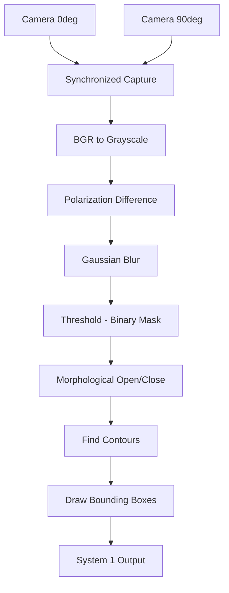

# 📷 06 — OpenCV for Computer Vision

> Project: **Black-Ice-Detection-AI**

OpenCV (**Open** **C**omputer **V**ision library) is the primary library used to capture, read, manipulate, and display images and video in this project. Where [`03_numpy.md`](./03_numpy.md) taught you that an image *is* an array, this module teaches you how to actually get that array from a camera and start doing something useful with it.

---

## Learning Objectives

After completing this module, you should be able to:

- Read, display, and write images and video using OpenCV
- Understand OpenCV's color space conventions (and why they matter for this project)
- Capture synchronized frames from two cameras
- Apply thresholding and morphological operations to isolate regions of interest
- Draw annotations (bounding boxes, contours) on detection results
- Connect every operation above to a concrete step in the Black-Ice-Detection-AI pipeline

---

## Introduction

### What is OpenCV?

OpenCV is an open-source computer vision and image processing library, originally written in C++ with bindings for Python (`opencv-python`), that provides highly optimized functions for image I/O, transformation, filtering, feature detection, and more.

### Why OpenCV Is Important Here

OpenCV is the layer that sits directly between the rover's physical cameras and everything downstream — NumPy array math ([Module 03](./03_numpy.md)), classical image processing ([Module 07](./07_image_processing.md)), and the CNN's input pipeline ([Module 11](./11_cnn.md)). Every frame the rover ever "sees" passes through OpenCV first.

---

## Why It Matters (Project Context)

| Pipeline Stage | OpenCV's Role |
|---|---|
| Dual camera capture | `cv2.VideoCapture` reads frames from each camera |
| Synchronization | Timestamp-aligning frames from both cameras before processing |
| Preprocessing | Undistortion, resizing, color conversion |
| Physics detection (System 1) | Thresholding, morphological operations on the polarization difference map |
| CNN input (System 2) | Resizing/normalizing frames to the model's expected input size |
| Result visualization | Drawing detected hazard regions on the output feed |

---

## Installing OpenCV

```bash
pip install opencv-python
# For extra modules (e.g. some feature detectors) if ever needed:
pip install opencv-contrib-python
```

Verify installation:

```python
import cv2
print(cv2.__version__)
```

---

## Reading, Displaying, and Writing Images

```python
import cv2

# Read an image from disk (returns a NumPy array, BGR order)
img = cv2.imread("dataset/raw/sample_road.jpg")

# Display it in a window (blocks until a key is pressed)
cv2.imshow("Road Surface", img)
cv2.waitKey(0)
cv2.destroyAllWindows()

# Write an image to disk
cv2.imwrite("dataset/processed/sample_road_processed.jpg", img)
```

> ⚠️ **Headless devices note:** `cv2.imshow()` requires a display and will fail (or hang) on a headless Raspberry Pi/Jetson Nano SSH session. For deployment scripts, save frames to disk or stream them instead — see [`20_deployment.md`](./20_deployment.md).

---

## BGR vs RGB — OpenCV's Biggest Gotcha

**OpenCV loads and stores color images in BGR order, not RGB.** This trips up nearly everyone the first time they mix OpenCV with Matplotlib (which expects RGB) or a deep learning framework (which typically expects RGB).

```python
img_bgr = cv2.imread("frame.jpg")               # BGR order, OpenCV default
img_rgb = cv2.cvtColor(img_bgr, cv2.COLOR_BGR2RGB)   # convert for correct display/model input
```

**Project rule:** convert BGR → RGB immediately after capture if the frame is headed toward the CNN or any visualization outside OpenCV's own `imshow`. Keep BGR only within pure-OpenCV processing chains.

---

## Color Spaces

| Color Space | Use in This Project |
|---|---|
| BGR / RGB | Raw camera capture, CNN input |
| **Grayscale** | Simplifies polarization difference computation, reduces data before thresholding |
| **HSV** | More robust to lighting changes than RGB — useful for wet vs. dry road color/saturation cues |

```python
gray = cv2.cvtColor(img, cv2.COLOR_BGR2GRAY)
hsv  = cv2.cvtColor(img, cv2.COLOR_BGR2HSV)
```

---

## Camera Capture (Single Camera)

```python
cap = cv2.VideoCapture(0)   # 0 = default camera index

if not cap.isOpened():
    raise RuntimeError("Camera failed to open")

while True:
    ret, frame = cap.read()
    if not ret:
        break
    cv2.imshow("Live Feed", frame)
    if cv2.waitKey(1) & 0xFF == ord('q'):
        break

cap.release()
cv2.destroyAllWindows()
```

---

## Dual-Camera Capture & Synchronization

This project uses **two synchronized cameras** with orthogonal polarizing filters (0° and 90°). The core requirement is that both frames represent *the same instant* — a time mismatch between them corrupts the polarization difference calculation.

```python
import cv2
import time

cap_0deg = cv2.VideoCapture(0)   # camera behind 0° polarizing filter
cap_90deg = cv2.VideoCapture(1)  # camera behind 90° polarizing filter

def capture_synchronized_pair(cap_a, cap_b):
    """Grab frames from both cameras as close together in time as possible."""
    cap_a.grab()
    cap_b.grab()
    ret_a, frame_a = cap_a.retrieve()
    ret_b, frame_b = cap_b.retrieve()
    if not (ret_a and ret_b):
        raise RuntimeError("Failed to capture synchronized frame pair")
    return frame_a, frame_b

frame_0deg, frame_90deg = capture_synchronized_pair(cap_0deg, cap_90deg)
```

**Why `.grab()` then `.retrieve()` instead of `.read()` twice:** `.read()` combines grab (capture at that instant) and decode (convert to a usable frame) into one call. Calling `.grab()` on both cameras back-to-back captures both instants as close together as hardware allows, *then* decoding both afterward — minimizing the timestamp gap between the pair. This is directly relevant to [Module 13 — Polarization Imaging](./13_polarization_imaging.md).

---

## Resizing and Undistortion

```python
resized = cv2.resize(img, (640, 480))

# Undistortion requires calibration data (camera matrix + distortion coefficients)
# See Module 17 — Camera Geometry for how these are derived
undistorted = cv2.undistort(img, camera_matrix, dist_coeffs)
```

Undistortion matters for accurate **distance estimation** (Module 17) — a distorted image gives inaccurate real-world measurements of where a detected hazard actually is relative to the rover.

---

## Thresholding

Thresholding converts a grayscale/contrast image into a **binary mask** — the core operation behind System 1's physics-based detection.

```python
gray = cv2.cvtColor(img, cv2.COLOR_BGR2GRAY)

# Simple fixed threshold
_, mask = cv2.threshold(gray, 127, 255, cv2.THRESH_BINARY)

# Adaptive threshold — better when lighting varies across the frame
adaptive_mask = cv2.adaptiveThreshold(
    gray, 255, cv2.ADAPTIVE_THRESH_GAUSSIAN_C, cv2.THRESH_BINARY, 11, 2
)

# Otsu's method — automatically determines the optimal threshold value
_, otsu_mask = cv2.threshold(gray, 0, 255, cv2.THRESH_BINARY + cv2.THRESH_OTSU)
```

**Project use case:** after computing the polarization difference map, thresholding isolates pixels whose contrast falls in the range characteristic of black ice, producing the binary candidate mask that morphological operations refine next.

---

## Morphological Operations

Morphological operations clean up binary masks — removing noise, closing small gaps, isolating meaningful regions.

```python
kernel = cv2.getStructuringElement(cv2.MORPH_ELLIPSE, (5, 5))

erosion  = cv2.erode(mask, kernel, iterations=1)    # shrinks white regions, removes small noise
dilation = cv2.dilate(mask, kernel, iterations=1)    # grows white regions, fills small holes
opening  = cv2.morphologyEx(mask, cv2.MORPH_OPEN, kernel)   # erosion then dilation — removes noise
closing  = cv2.morphologyEx(mask, cv2.MORPH_CLOSE, kernel)  # dilation then erosion — closes gaps
```

| Operation | Effect | Project Use Case |
|---|---|---|
| Erode | Shrinks white regions | Remove tiny spurious noise pixels from the threshold mask |
| Dilate | Grows white regions | Fill small gaps within a real ice patch |
| Open | Erode → Dilate | Remove small noise blobs while preserving overall shape |
| Close | Dilate → Erode | Close small holes inside a detected ice region |

---

## Contours & Bounding Boxes

Once a mask is clean, contours identify distinct connected regions — individual candidate hazard patches.

```python
contours, _ = cv2.findContours(mask, cv2.RETR_EXTERNAL, cv2.CHAIN_APPROX_SIMPLE)

for c in contours:
    area = cv2.contourArea(c)
    if area < 50:          # filter out tiny noise contours
        continue
    x, y, w, h = cv2.boundingRect(c)
    cv2.rectangle(img, (x, y), (x + w, y + h), (0, 0, 255), 2)   # red box, BGR order
    cv2.putText(img, "Possible Black Ice", (x, y - 10),
                cv2.FONT_HERSHEY_SIMPLEX, 0.6, (0, 0, 255), 2)
```

This is the mechanism behind visualizing System 1's output — every hazard region becomes a labeled bounding box on the rover's output feed.

---

## Filtering / Blurring

```python
blurred = cv2.GaussianBlur(gray, (5, 5), 0)   # reduces noise before thresholding
median  = cv2.medianBlur(gray, 5)              # good for salt-and-pepper sensor noise
```

**Project use case:** applying a Gaussian blur before thresholding reduces false-positive noise from camera sensor grain, which otherwise fragments the polarization contrast map into spurious tiny regions.

---

## Edge Detection

```python
edges = cv2.Canny(gray, threshold1=100, threshold2=200)
```

Useful for road boundary detection or distinguishing sharp puddle edges (wet road) from the more diffuse, low-contrast boundary typical of black ice.

---

## Visual Pipeline



---

## Real Project Application

Putting several sections above together — a simplified end-to-end System 1 preprocessing sketch:

```python
import cv2
import numpy as np

def detect_candidate_regions(frame_0deg: np.ndarray, frame_90deg: np.ndarray) -> list:
    """Return bounding boxes of candidate hazard regions from a synchronized frame pair."""
    gray_0 = cv2.cvtColor(frame_0deg, cv2.COLOR_BGR2GRAY).astype(np.int16)
    gray_90 = cv2.cvtColor(frame_90deg, cv2.COLOR_BGR2GRAY).astype(np.int16)

    diff = np.abs(gray_0 - gray_90).astype(np.uint8)
    blurred = cv2.GaussianBlur(diff, (5, 5), 0)

    _, mask = cv2.threshold(blurred, 0, 255, cv2.THRESH_BINARY + cv2.THRESH_OTSU)

    kernel = cv2.getStructuringElement(cv2.MORPH_ELLIPSE, (5, 5))
    mask = cv2.morphologyEx(mask, cv2.MORPH_OPEN, kernel)
    mask = cv2.morphologyEx(mask, cv2.MORPH_CLOSE, kernel)

    contours, _ = cv2.findContours(mask, cv2.RETR_EXTERNAL, cv2.CHAIN_APPROX_SIMPLE)
    boxes = [cv2.boundingRect(c) for c in contours if cv2.contourArea(c) > 50]
    return boxes
```

This function is essentially the skeleton of what `physics_model/` will contain once fully implemented in Phase 4.

---

## Best Practices

- Always check `cap.isOpened()` and `ret` return values — silent capture failures are a common source of confusing downstream bugs
- Convert BGR → RGB explicitly whenever a frame leaves pure-OpenCV processing (CNN input, Matplotlib display)
- Release camera captures (`cap.release()`) and destroy windows in a `finally` block or context manager, especially in long-running rover scripts
- Filter contours by area before treating them as detections — raw thresholding always produces some noise
- Use `.grab()` + `.retrieve()` for any multi-camera synchronization, never sequential `.read()` calls

---

## Common Mistakes

- Assuming OpenCV images are RGB when they're actually BGR — causes color-swapped visualizations and, worse, silently wrong CNN inputs if not caught
- Calling `.read()` sequentially on two cameras and assuming the frames are synchronized — they aren't, since the second capture happens after the first completes
- Forgetting `dtype` casting before subtracting grayscale images, causing `uint8` overflow (see [Module 03](./03_numpy.md#common-mistakes))
- Not filtering small contours, leading to dozens of spurious "detections" from sensor noise
- Running `cv2.imshow()` in a headless deployment script and having it hang or crash

---

## Performance Tips

- Downscale frames with `cv2.resize()` before heavy processing when full resolution isn't needed — this matters significantly on Raspberry Pi/Jetson Nano
- Reuse the structuring element (`cv2.getStructuringElement`) instead of recreating it every frame
- Prefer `cv2.THRESH_OTSU` over manually tuning a fixed threshold when lighting conditions vary between test runs
- Profile capture vs. processing time separately — on embedded hardware, capture I/O can be a bigger bottleneck than the CV math itself

---

## Exercises

1. Write a script that captures a single frame from your webcam and saves it to `dataset/raw/`.
2. Load a sample road image, convert it to grayscale, and apply Otsu thresholding. Display both the original and the mask side by side.
3. Simulate two "polarized" frames by applying different brightness offsets to the same source image with NumPy, then compute and threshold their difference.
4. Write a function that takes a binary mask and returns the number and average area of detected contours.
5. Benchmark `cv2.resize()` at three different target resolutions and measure the processing time difference for a full thresholding + morphology pipeline.

## Practice Questions

1. Why does OpenCV use BGR instead of RGB, and where does this matter in this project's pipeline?
2. What's the practical difference between `cap.read()` and `cap.grab()` + `cap.retrieve()` for multi-camera setups?
3. When would you choose adaptive thresholding over Otsu's method?
4. Why is a Gaussian blur applied before thresholding rather than after?

## Interview Questions

1. Explain the difference between erosion, dilation, opening, and closing, with an example use case for each.
2. How would you detect and remove small noise regions after thresholding an image?
3. What is Otsu's thresholding method, and when does it fail?
4. How would you synchronize frames from two independent camera feeds with minimal timestamp drift?
5. Why might you convert an image to HSV instead of working directly in RGB/BGR for certain detection tasks?

---

## Summary

OpenCV is the bridge between the rover's physical cameras and every downstream processing step — capture, color conversion, thresholding, morphology, and contour detection are the exact operations System 1's physics-based pipeline is built from. The BGR convention and dual-camera synchronization technique covered here are the two project-specific details most likely to cause subtle bugs if skipped over.

## Revision Notes

- OpenCV loads images in **BGR**, not RGB — convert explicitly when needed
- Dual-camera sync: `.grab()` both, then `.retrieve()` both — never sequential `.read()`
- Thresholding → binary mask; Morphology (open/close) → clean mask; Contours → discrete regions
- Always filter contours by minimum area to suppress noise

## References

- [OpenCV-Python Official Tutorials](https://docs.opencv.org/4.x/d6/d00/tutorial_py_root.html)
- [OpenCV `cv2.threshold()` documentation](https://docs.opencv.org/4.x/d7/d4d/tutorial_py_thresholding.html)
- [OpenCV Morphological Transformations](https://docs.opencv.org/4.x/d9/d61/tutorial_py_morphological_ops.html)

---

## Next Topic

➡️ [`07_image_processing.md`](./07_image_processing.md) — **Image Processing**

The next module goes deeper into the classical image processing techniques (filtering, edge detection, contrast enhancement) that make System 1's physics-based detection robust to real-world lighting and noise conditions.
