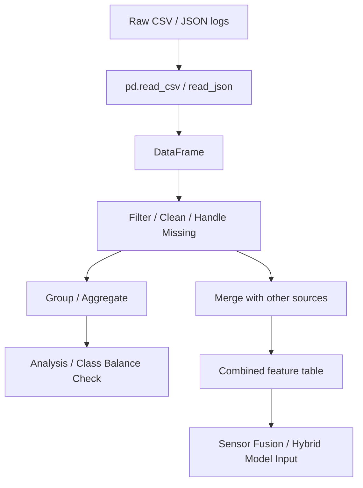

# 🐼 04 — Pandas for Data Handling

> Project: **Black-Ice-Detection-AI**

---

## Learning Objectives

After completing this module, you should be able to:

- Understand the `Series` and `DataFrame` data structures
- Load, inspect, filter, and transform tabular data
- Handle missing or malformed data safely
- Group and aggregate data for analysis
- Merge multiple data sources together
- Apply all of the above to dataset annotation, experiment tracking, and sensor log analysis in this project

---

## Introduction

### What is Pandas?

Pandas provides two core data structures — the 1D `Series` and the 2D `DataFrame` — for working with labeled, tabular data, along with a large set of tools for reading, cleaning, filtering, grouping, and exporting that data. It's built on top of NumPy, so operations on Pandas columns are backed by the same vectorized performance.

### Why Pandas Is Important Here

This project generates a lot of structured, non-image data: dataset annotations (which image is Black Ice vs. Wet Road), experiment results (accuracy per run, per hyperparameter setting), and sensor logs (IMU/temperature readings over time, tagged with timestamps). None of this is naturally a NumPy array — it has mixed types, labels, and often gaps. That's exactly the problem Pandas solves.

---

## Why It Matters (Project Context)

| Project Activity | Pandas' Role |
|---|---|
| Dataset annotations | `dataset/annotations/labels.csv` — filename, class label, source, split (train/val/test) |
| Experiment tracking | `experiments/*.md` results tables, or a master `experiments/results.csv` log |
| Sensor data analysis | Loading IMU/temperature logs, filtering by time window, computing rolling statistics |
| Model evaluation | Building per-class accuracy tables, comparing runs across `results/` |
| Data cleaning | Catching mislabeled, duplicated, or corrupted dataset entries before training |

---

## Installing Pandas

```bash
pip install pandas
```

```python
import pandas as pd
print(pd.__version__)
```

---

## Core Data Structures

### Series (1D, labeled)

```python
temps = pd.Series([-3.2, -1.5, 0.4, 2.1], name="temperature_c")
temps.index      # RangeIndex(start=0, stop=4, step=1) by default
```

### DataFrame (2D, labeled rows and columns)

```python
data = {
    "filename": ["img_001.jpg", "img_002.jpg", "img_003.jpg"],
    "label": ["black_ice", "wet_road", "dry_road"],
    "temperature_c": [-2.5, 4.1, 12.0],
    "split": ["train", "train", "validation"],
}
df = pd.DataFrame(data)
```

| filename | label | temperature_c | split |
|---|---|---|---|
| img_001.jpg | black_ice | -2.5 | train |
| img_002.jpg | wet_road | 4.1 | train |
| img_003.jpg | dry_road | 12.0 | validation |

---

## Reading & Writing Data

```python
df = pd.read_csv("dataset/annotations/labels.csv")

df.to_csv("dataset/annotations/labels_cleaned.csv", index=False)

# Other common formats
pd.read_json("logs/session_01.json")
pd.read_excel("results/summary.xlsx")
```

**Project use case:** `dataset/annotations/labels.csv` is exactly this pattern — a flat file mapping every image filename to its ground-truth class label, loaded once at the start of training.

---

## Inspecting Data

```python
df.head()        # first 5 rows
df.tail(3)        # last 3 rows
df.info()         # column dtypes, non-null counts, memory usage
df.describe()     # summary statistics for numeric columns
df.shape          # (rows, columns)
df.columns        # column names
df["label"].unique()          # distinct class labels present
df["label"].value_counts()    # count of images per class — check for class imbalance!
```

**Project use case:** `df["label"].value_counts()` is the very first thing to run on your dataset annotations — if Black Ice has 50 images and Dry Road has 2,000, your CNN will need class balancing or weighted loss ([Module 09 — Deep Learning](./09_deep_learning.md)) or it will just learn to always predict Dry Road.

---

## Selecting & Filtering Data

```python
df["label"]                          # select one column -> Series
df[["filename", "label"]]            # select multiple columns -> DataFrame

df[df["label"] == "black_ice"]                     # filter rows by condition
df[(df["split"] == "train") & (df["temperature_c"] < 0)]   # multiple conditions

df.loc[0, "label"]        # label-based indexing: row 0, column "label"
df.iloc[0, 1]              # position-based indexing: row 0, column index 1
```

**Project use case:** filtering `df[df["split"] == "train"]` is how you split your annotation table into train/validation/test subsets before feeding filenames into the CNN's data loader.

---

## Handling Missing Data

```python
df.isnull().sum()              # count missing values per column
df.dropna()                     # remove rows with any missing values
df.fillna(0)                    # fill missing values with a default
df["temperature_c"].fillna(df["temperature_c"].mean(), inplace=True)
```

**Project use case:** a sensor log with a temporarily disconnected IR sensor will have gaps — deciding whether to drop those rows or interpolate/fill them is a real data-quality decision that affects System 1's temperature verification reliability.

---

## Adding, Modifying, and Dropping Columns

```python
df["is_hazard"] = df["label"].isin(["black_ice", "snow"])
df["temperature_f"] = df["temperature_c"] * 9 / 5 + 32
df.drop(columns=["temperature_f"], inplace=True)
df.rename(columns={"temperature_c": "surface_temp_c"}, inplace=True)
```

---

## Grouping & Aggregation

```python
df.groupby("label")["temperature_c"].mean()
df.groupby(["label", "split"]).size()
df.groupby("label").agg(
    avg_temp=("temperature_c", "mean"),
    count=("filename", "count"),
)
```

**Project use case:** `groupby("label")["temperature_c"].mean()` immediately tells you whether your labeled Black Ice images actually correspond to sub-zero temperature readings — a sanity check that catches mislabeled data before it poisons training.

---

## Sorting

```python
df.sort_values("temperature_c")                     # ascending
df.sort_values("temperature_c", ascending=False)     # descending
df.sort_values(["label", "temperature_c"])           # multi-column sort
```

---

## Merging & Joining DataFrames

```python
labels_df = pd.read_csv("dataset/annotations/labels.csv")
sensor_df = pd.read_csv("logs/sensor_readings.csv")

merged = pd.merge(labels_df, sensor_df, on="filename", how="left")
```

| `how` | Behavior |
|---|---|
| `"inner"` | Only rows present in both DataFrames |
| `"left"` | All rows from the left DataFrame, matched where possible |
| `"right"` | All rows from the right DataFrame |
| `"outer"` | All rows from both, filling gaps with `NaN` |

**Project use case:** joining `labels.csv` (filename → ground-truth class) with `sensor_readings.csv` (filename → IMU/temperature at capture time) into a single table is how you assemble the full feature set the Hybrid Decision Engine (Phase 6) trains or reasons on.

---

## Applying Functions

```python
df["label_upper"] = df["label"].apply(lambda x: x.upper())

def temp_category(t):
    if t <= 0:
        return "freezing"
    elif t <= 10:
        return "cold"
    return "mild"

df["temp_category"] = df["temperature_c"].apply(temp_category)
```

---

## Working with Time Series (Sensor Logs)

```python
df["timestamp"] = pd.to_datetime(df["timestamp"])
df = df.set_index("timestamp")

df.resample("1min").mean()        # downsample IMU readings to 1-minute averages
df["accel_x"].rolling(window=5).mean()   # 5-sample rolling average, smooths noise
```

**Project use case:** raw IMU data is noisy and sampled far faster than needed for hazard classification — resampling and rolling averages are how you smooth it into a usable feature before sensor fusion (Phase 7).

---

## Visual Overview



---

## Real Project Application

A realistic dataset-preparation function:

```python
import pandas as pd

def load_and_validate_annotations(csv_path: str) -> pd.DataFrame:
    """Load dataset annotations and run basic sanity checks before training."""
    df = pd.read_csv(csv_path)

    required_cols = {"filename", "label", "split"}
    missing = required_cols - set(df.columns)
    if missing:
        raise ValueError(f"Missing required columns: {missing}")

    valid_labels = {"black_ice", "wet_road", "dry_road", "snow"}
    invalid = df[~df["label"].isin(valid_labels)]
    if not invalid.empty:
        raise ValueError(f"Found {len(invalid)} rows with invalid labels")

    print("Class distribution:\n", df["label"].value_counts())
    print("\nSplit distribution:\n", df["split"].value_counts())

    return df
```

This is exactly the kind of validation step that belongs in `scripts/` and should run before every training session in Phase 5.

---

## Best Practices

- Always run `df.info()` and `value_counts()` on a new dataset before doing anything else with it
- Check for class imbalance early — it changes your training strategy (weighted loss, augmentation targets)
- Use `.loc`/`.iloc` explicitly rather than chained indexing (`df[df.x > 0]["y"] = 1`), which can trigger Pandas' `SettingWithCopyWarning` and silently fail to modify the original DataFrame
- Validate merges — check row counts before and after `pd.merge()` to catch unexpected duplication or row loss
- Keep raw annotation CSVs untouched; write cleaned versions to a new file rather than overwriting the source

---

## Common Mistakes

- Ignoring class imbalance in `dataset/annotations/labels.csv` until training results look mysteriously bad
- Using chained assignment (`df[cond]["col"] = value`) instead of `.loc[cond, "col"] = value`, causing silent no-ops
- Merging on a key with duplicate or inconsistent values (e.g. filename casing mismatches), silently duplicating or dropping rows
- Filling missing sensor values with `0` without considering whether `0` is a *meaningful* value for that sensor (e.g. `0°C` is a real, important reading — filling missing temperature with `0` would be actively misleading)
- Forgetting `parse_dates`/`pd.to_datetime()` when working with timestamped sensor logs, leaving timestamps as unsortable strings

---

## Performance Tips

- Prefer vectorized column operations (`df["c"] = df["a"] + df["b"]`) over `.apply()` with a Python function where possible — `.apply()` is convenient but slower
- Use `dtype` hints (`pd.read_csv(..., dtype={"label": "category"})`) for large annotation files to reduce memory usage
- For very large sensor logs, consider chunked reading (`pd.read_csv(..., chunksize=10000)`) instead of loading everything into memory at once

---

## Summary

Pandas is the tool for everything in this project that isn't raw pixel/array data — dataset annotations, experiment logs, and sensor readings all live as DataFrames. The habits that matter most here are checking class balance immediately, being deliberate about missing-value handling (especially for sensor readings where `0` is a real value), and validating merges before trusting a combined feature table headed into the Hybrid Decision Engine.

## Revision Notes

- `Series` = 1D labeled array; `DataFrame` = 2D labeled table
- `.loc` = label-based indexing; `.iloc` = position-based indexing
- Always check `value_counts()` for class imbalance before training
- Use `.loc[cond, col] = value` instead of chained indexing assignment
- `pd.merge()` — verify row counts before/after to catch duplication or row loss

---

## Next Topic

➡️ [`05_opencv.md`](./05_opencv.md) — **OpenCV for Computer Vision**

With array math (NumPy), visualization (Matplotlib), and structured data (Pandas) covered, the next module moves into actually capturing and processing images from the rover's cameras.
